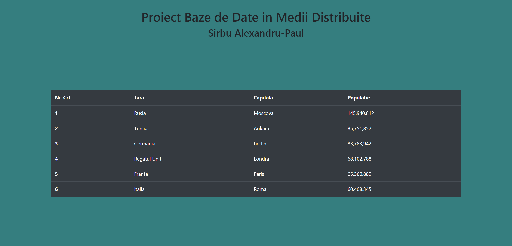

# Database-Project-in-Distributed-Environments
 This is a project done in the 2nd year of the Master's and consists in building a web server with the help of the Javascript / Node.JS language, which will realize
 multiple connections (asynchronous) with different data sources, either by direct query (SQL / NoSQL) or by
through an API or a file.

## 
